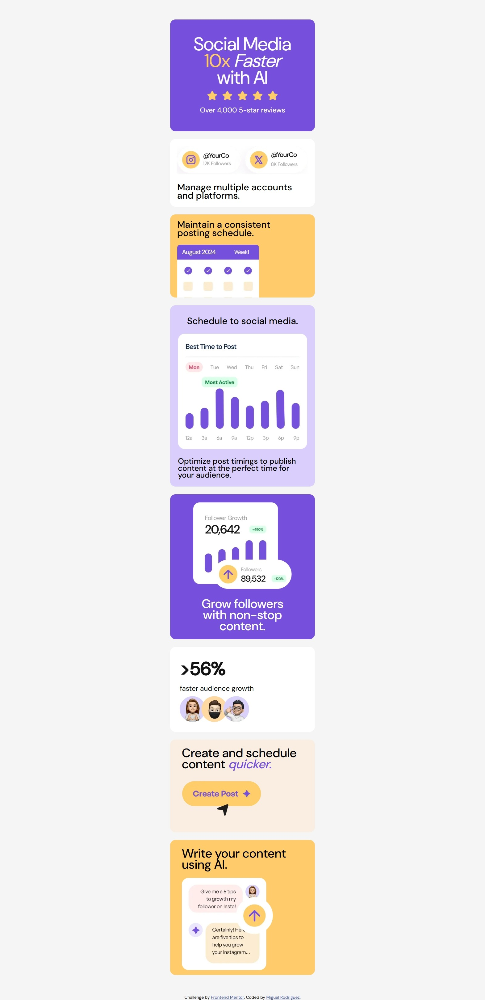

# Frontend Mentor - Bento grid solution

This is a solution to the [Bento grid challenge on Frontend Mentor](https://www.frontendmentor.io/challenges/bento-grid-RMydElrlOj). Frontend Mentor challenges help you improve your coding skills by building realistic projects. 

## Table of contents

- [Frontend Mentor - Bento grid solution](#frontend-mentor---bento-grid-solution)
  - [Table of contents](#table-of-contents)
  - [Overview](#overview)
    - [The challenge](#the-challenge)
    - [Screenshot](#screenshot)
    - [Links](#links)
  - [My process](#my-process)
    - [Built with](#built-with)
  - [Author](#author)

## Overview

### The challenge

Users should be able to:

- View the optimal layout for the interface depending on their device's screen size

### Screenshot

### Links

- Solution URL: [Click here](https://www.frontendmentor.io/solutions/bento-grid-main-YITCkacSyE)
- Live Site URL: [Click here](https://alex1999-03.github.io/bento-grid-main)

## My process

### Built with

- Semantic HTML5 markup
- CSS custom properties
- Flexbox
- CSS Grid
- Mobile-first workflow
- BEM

## Author

- Website - [Miguel Rodriguez](https://github.com/Alex1999-03)
- Frontend Mentor - [@Alex1999-03](https://www.frontendmentor.io/profile/Alex1999-03)